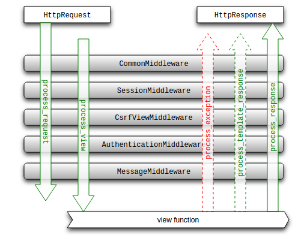

# Dependency Management

Useful tools like

## [Poetry](https://python-poetry.org/)

> Poetry comes with all the tools you might need to manage your projects in a deterministic way.

- one stop shop for manage everythign related to the project

## Virtual Environments

```python
poetry init

poetry env list
poetry env info / use

poetry add / remove
```

## Questions

- What does contrib mean in DB?
  - Contributions, contributed to the project
  - Might NOT be directly maintained by the main developers

## PostgresSQL RDBMS

https://fedoraproject.org/wiki/PostgreSQL

```
sudo su - postgres
sudo -u postgres psql

```

| Postgres Commands | Description                     |
| ----------------- | ------------------------------- |
| \password         | change `postgres` user password |
| \l                | list databases                  |
| \c DB_NAME        | connect to a database           |
| \dt               | show tables                     |

## [Django Profiling](https://docs.python.org/3/library/profile.html)

using tools like [cProfile](https://docs.python.org/3/library/profile.html#module-cProfile)

```python
python -m cProfile myscript.py
```

## Django Throttling

if DB have enough Analytics data, then I can make decision

Throttling Middleware Policy

```
 'DEFAULT_THROTTLE_RATES': {
            'anon': '70/minute',
            'user': '70/minute',
            'user_sec': '2/second',
            'user_min': '120/minute',
            'user_hour': '7200/hour',
        },
```

## Django Middleware



### Use Cases

- [x] Excellent place for capturing analytics.
  - Request recieved and request sent, REQUEST_TOTAL_PROCESSING_TIME
- [x] Custom Exception Middleware, we dont know what exception it is. We can use our own custom exception handler
- [x] Authentication and Authorization Middlewares
- [x] Request Throttling Middlewares
- [x] Page MetaData Middlewate

## IDL Interface Definition Language

- JSON
- ProtocolBuffer
- gRPC
- Facebook Thrift, saves **8 bytes** in comparision to HTTP transport

always ADD_TIME_CONSTRAINT_WINDOW to cron jobs. Eg: send emails from Friday to Monday, please check time before actually sending it.

## SQL for Data Analytic and Data Science

> Hierarchy of Data Needs

from multiple DATA-sources

- Aggregations
- Customer Retention, login, visit patterns
- **User Activity** from RealTime logs, like google Analytics
- Experience with statistical methods of Forcasting, time-series, Hypothesis testing, classification, clustering, and regression analysis

  - when you clicked ?
  - what you clicked ?
  - What were you doing before you clicked ?
  - which device, platform and browser were you using ?

- How did the Experiement A/B perform?
- How did the Marketting campaign go?

#### Big Query

- [x] Daily, monthly and weekly active users?
- [ ] Compare the activity of subscription types
- [ ] Daily new installs
- [ ] Daily new paying subscribers
- [ ] Activity by the time of the day

How to design DB schema for a CMS?

[django schema](https://drawsql.app/templates/django)
[python wagtail CMS schema](https://drawsql.app/templates/wagtail)

