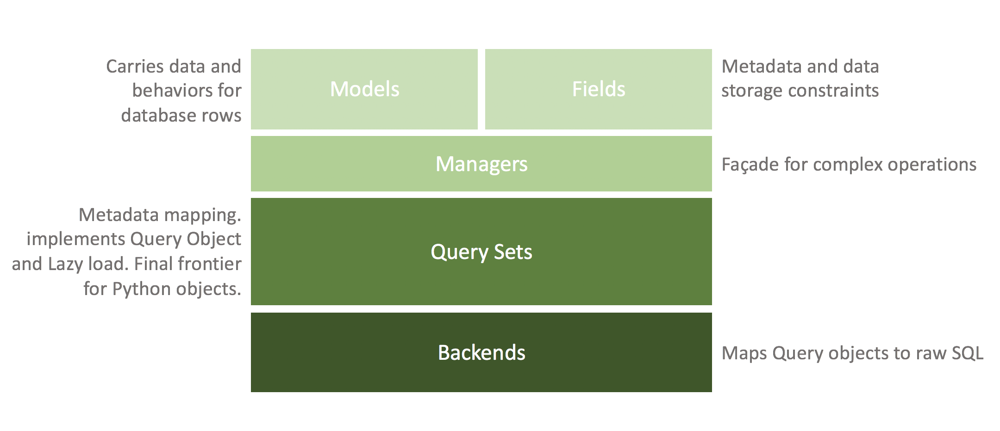

# Django Rest Framework

- Framework built on top of django
- [x] web browsable API
- [x] Serialization - machine to language representations
- [ ] Internationalization
  - not content itself but error messages
- [x] schema, what resources API offers and what operations can be performed on them
- [x] GraphQL Schema Definition Language (SDL),

## How it works

- Request is captured by WSGI/ASGI implementation and then passed down to python world
- python matches the URL to a python object responsible for processing request
- View Class will have, ViewSets abstration level
  - queryset
  - serializer_class
  - permission_classes
- Authorization
  - Login and authentication
  - Object level permissions

### CMS vs django admin panel

- Focus, focus is towards published, draft and preview content
- Usability, easy drag and drop

## Questions

> Before RESTful APIs, we had RPC, SOAP, CORBA, and other less open protocols.

- Does DRF have GraphQL? it does have openAPI schema
- HOw to connect django models to graphene objects types?
- REST vs GraphQL?
  - Unlike a RESTful API, there is only a single URL from which GraphQL is accessed. Requests to this URL are handled by Graphene’s GraphQLView view.
  - A REST API is an architectural concept for network-based software. GraphQL, on the other hand, is a query language, a specification, and a set of tools that operates over a single endpoint using HTTP
  - , if you wanted to request information from two objects, you’d need to perform two REST API requests. The advantage of REST APIs is its simplicity—you have one endpoint that does one task, so it’s easy to understand and manipulate. In other words, if you have X endpoint, it provides X data.
  -

## Available Tooling

- django
- django-rest-framework
- graphene
- django-cms
- django-graphene
  - single graphQL endpoint in `urls.py`, define schema

## CMS Lingo

- pages and sub-pages, URL directory path

## GraphQL

- [Relay](https://relay.dev/docs/) is a JavaScript framework for fetching and managing GraphQL data in React applications that emphasizes maintainability, type safety and runtime performance.

```graphql
# query {
#   allIngredients {
#     id
#     name
#     notes
#     category {
#       id
#     }
#   }
# }

# query {
#   categoryByName(name: "Dairy") {
#     id
#     name
#     ingredients {
#       id
#       name
#       notes
#     }
#   }
# }

query {
  categoryByName(name: "Meat") {
    __typename
    name
    ingredients {
      __typename
      name
      notes
    }
  }
}
```

## Deployment

```
./configure --enable-optimizations --prefix=$HOME/python3.7
make
make test
sudo make install # puts the packages in PREFIX PATH
```

- https://cloud.google.com/python/django
- Multiple deployment options
  - kubernetes engine
  - cloud run, serverless
  - compute engine
  - app engine
- Which DB to use? which are officially supported, SQL
  - cloud SQL and Postgres on GCP
  - [python-spanner-django](https://github.com/googleapis/python-spanner-django/) for OLTP and horizontal scaling for RDBMS

```
The outside world <-> Nginx <-> The socket <-> Gunicorn

WEB SERVER | Nginx, reverse proxy
APP SERVER | gunicorn, uWSGI, ASGI

❯ daphne cookbook.asgi:application
```

## Django database data

### Dummy data

Fixtures: data in a format that django can understand

```
python manage.py dumpdata
python manage.py loaddata
```

### Real database data

```
pip install django-dbbackup

python manage.py listbackups

# Backup the DB
python manage.py dbbackup
python manage.py dbrestore

# Backup the app source files
python manage.py mediabackup
python manage.py mediarestore
```

## Django models



### DAL - [Data Access Layer Abstraction](https://en.wikipedia.org/wiki/Data_access_layer)

Why use Patterns here?

- [x] we want to use same DAL inteface for multiple DB technologies, no breaking changes
- [x] We want to make efficient, bulk DB operations over multiple single atomic operations. **UnitOfWork**
- [x] Implementation Examples, [ORM](https://en.wikipedia.org/wiki/Object%E2%80%93relational_mapping)

Over the time we learnt, things can be best seperated :)

Seperation of actual query vs DB Technology

1. Active Record and Active Table Pattern (in-memory)
2. Repository Pattern
   1. Interface that is independent of data access technology itself
   2. CQRS, Caching
   3. unit of work pattern - clear coding path, akin to RDBMS Transactions
      1. DIP - seperating high-level-module from low-level module
      2. **keep track of changes** that you want to commit to DB, accumulate and then push bulk update to DB

- Django models are based on [Active Record Pattern](https://en.wikipedia.org/wiki/Active_record_pattern)
- Django Managers are loosely based on [Table Data Gateway pattern](https://en.wikipedia.org/wiki/Table_data_gateway)
- Django Query Set is based of [Query Object Pattern](https://martinfowler.com/eaaCatalog/queryObject.html)
  - Encapsulate queries and just return expected entities
  - Lazy loading

Models -> [Model Manager](https://docs.djangoproject.com/en/3.2/topics/db/managers/) -> database

- Every Model has a Manager class which communicates with real DB

#### Django Manager Use-Cases

- Complex and reusable **filters**. If it’s necessary to create a complex or reusable filter, you can develop your own manager with a method that makes this work.
- Add analytics to DB queries, responses. Data Enrichment, enhancement, data transformation

## Static types in python

- starting 3.5 python have optional type annotations
- python have Generics, `TypeVar`
- Interfaces using `metaclass=abc.ABCMeta`

## Logitivity models

- repeatable Patterns, write styleguide
- unused layers of Abstractions
- Business Logic, contrainsts and relationships
- Frameworks are like Boxes, one box for each seperate thing.
- custom validations
- per-site-visitor data collection, Session Framework
  - HTTP is stateless, then how we track user information? => Cookies/Sessions
  - Internal `django_session` table
  - HTTP Header, `set-cookie: "session-id"`

## Questions

- Does number of tables affect the DB performance? like 2k? or its the queries that does?
- [OAuth with django for public APIs](https://django-oauth-toolkit.readthedocs.io/en/latest/)
- [How to deal with payment with django?](https://django-payments.readthedocs.io/en/latest/)
- How to insert new items in DB and update existing ones?
  - `models.save()` is the only operation that toucches the DB
  - emits pre_save and post_save hooks, signals
  - Automatically update the [last_updated_date](https://docs.djangoproject.com/en/dev/ref/models/fields/#django.db.models.DateField) for the content
- [Django Images backend - django-storages app](https://django-storages.readthedocs.io/en/latest/)
- [How to upload images from clinet to google storage bucket?](https://medium.com/google-cloud/google-cloud-storage-signedurl-resumable-upload-with-curl-74f99e41f0a2)
  1. Generate signed URL
  2. Send empty POST request, with signed URL as data
  3. This will return a 201 with actual location header
  4. Sent new PUT request to the returned location header
  5. [Eg repoe](https://github.com/Cache-and-Cookies/HiTea)

### [Django Channels for websockets](https://channels.readthedocs.io/en/latest/)

- Edit ASGI file
- Add [channels DJANGO_APP](https://channels.readthedocs.io/en/stable/)

### Django Permisssions

Permissions work between a user and the DB model.

- How to add a new permission, `can_view_blog` ?
  - Add permission boolean to model table, and then grant it to user account.

## Django optimizations

- You may want to avoid the **overhead** of an **index** if you are creating a **foreign key** for consistency rather than joins, or if you will be creating an alternative index like a partial or multiple column index.

> While other databases compute relationships at query time through expensive JOIN operations, a graph database stores connections **alongside the data in the model.**

- Accessing nodes and relationships in a native graph database is an efficient, constant-time operation and allows you to quickly traverse millions of connections per second per core.
- Python (django) function calls are pretty scale at-scale compared to attribute accesses
- Django production HTTP app server comparision? [uWSGI vs gunicorn](https://www.appdynamics.com/blog/engineering/a-performance-analysis-of-python-wsgi-servers-part-2/)
- How much resources are required to handle **1 Million** websocket connections?
  - django channels can handle **1M connection on 30GB instance**
  - CHANNELS => long-lived stateful HTTP connections
  - Linux has **>65k ports!** A single listening port can accept more than one connection simultaneously.

```
each TCP connection has 4 fields

source_ip source_port destination_ip destination_port
<----- client ------> <--------- server ------------>
```

#### graphQL js @client facebook/relay

While you can definitely implement **uploading files** to your GraphQL API endpoint, it's considered to be an anti-pattern (you will bump into issues with max file size etc.).

A better alternative would be obtaining a signed URL from your GraphQL API for uploading a file directly from the client-side app to Amazon S3, Google Cloud Storage etc.

If the server-side code needs to save URL in the database once the upload is complete, it can subscribe to this event directly. Check [object change notification](https://cloud.google.com/storage/docs/object-change-notification) in Google Cloud as an example.
